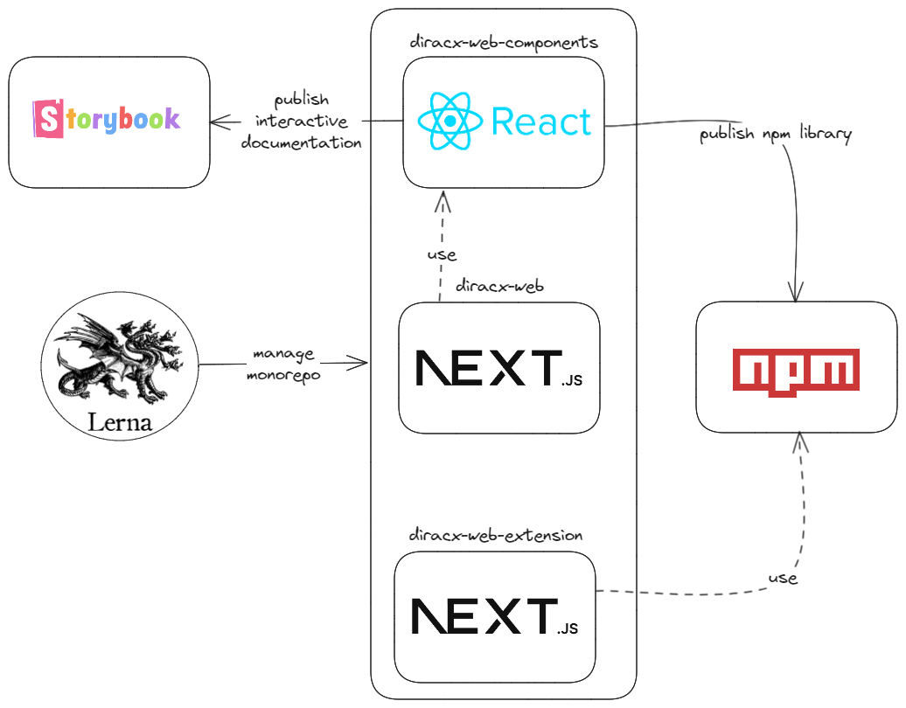

# DiracX-Web

## Overview

`diracx-web` is a web application that provides a user interface to interact with the [DiracX](https://github.com/DIRACGrid/diracx) service and is part of the [DIRAC](https://github.com/DIRACGrid) ecosystem.

This repository is organized as a monorepo, with the following key packages:

- [diracx-web](packages/diracx-web)
- [diracx-web-components](packages/diracx-web-components)
- [extensions](packages/extensions)



### Packages

- **DiracX-Web**: Vanilla Dirac web interface based on Next.js. Leverages components from `DiracX-Web-Components` to provide core functionalities.

- **DiracX-Web-Components**: A library of reusable React components designed for integration within the `DiracX-Web` package and to facilitate the creation of custom DiracX web extensions.

- **Extensions**: An illustrative example of a web extension demonstrating how to extend the functionality of `DiracX-Web` using the components from the `DiracX-Web-Components` package.

### Project Management

- [**npm**](https://docs.npmjs.com/): Used for dependency management.
- [**Release-Please**](https://github.com/googleapis/release-please): Automated release management for the project.

The dependency management is further detailed in the [Package Management](docs/package-management.md) documentation.

For more detailed and interactive documentation, visit our [Storybook](https://diracgrid.github.io/diracx-web) instance.

## Getting started

_Requirements: docker, internet_

This will allow you to run a demo setup:

```bash
# Clone the diracx-chart repository
git clone git@github.com:DIRACGrid/diracx-charts.git

# Run the demo
diracx-charts/run_demo.sh
```

You can also start the demo setup in development mode - code changes will be reflected in the demo in real time:

```bash
# Clone the diracx-web repository
git clone git@github.com:DIRACGrid/diracx-web.git

# Clone the diracx-chart repository
git clone git@github.com:DIRACGrid/diracx-charts.git

# Run the demo
diracx-charts/run_demo.sh ./diracx-web
```

## Contributing

See the [Contributing guidelines](/CONTRIBUTING.md)

## Testing

Unit tests can be started with:

```bash
npm test
```

End-to-end tests are launched through `cypress` such as:

```bash
# diracx-charts/run_demo.sh is running
npx cypress open --config baseUrl=$DIRACX_URL
```

## Learn More

To learn more about Next.js, take a look at the following resources:

- [Next.js Documentation](https://nextjs.org/docs) - learn about Next.js features and API.
- [Learn Next.js](https://nextjs.org/learn) - an interactive Next.js tutorial.
