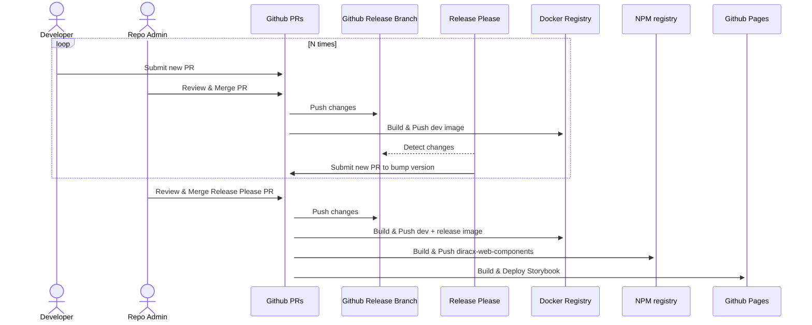

# Release Management

```mermaid
sequenceDiagram
  Actor Developer
  Actor RepoAdmin as Repo Admin
  participant GHPRs as Github PRs
  participant GHRelBranch as Github Release Branch
  participant RPlease as Release Please
  participant Docker as Docker Registry
  participant NPM as NPM registry
  participant GHPage as Github Pages
  loop N times
    Developer ->>+ GHPRs: Submit new PR
    RepoAdmin ->>+ GHPRs: Review & Merge PR
    GHPRs ->>+ GHRelBranch: Push changes
    GHPRs ->>+ Docker: Build & Push dev image
    RPlease -->> GHRelBranch: Detect changes
    RPlease ->>+ GHPRs: Submit new PR to bump version
  end
  RepoAdmin ->>+ GHPRs: Review & Merge Release Please PR
  GHPRs ->>+ GHRelBranch: Push changes
  GHPRs ->>+ Docker: Build & Push dev + release image
  GHPRs ->>+ NPM: Build & Push diracx-web-components
  GHPRs ->>+ GHPage: Build & Deploy Storybook
```
