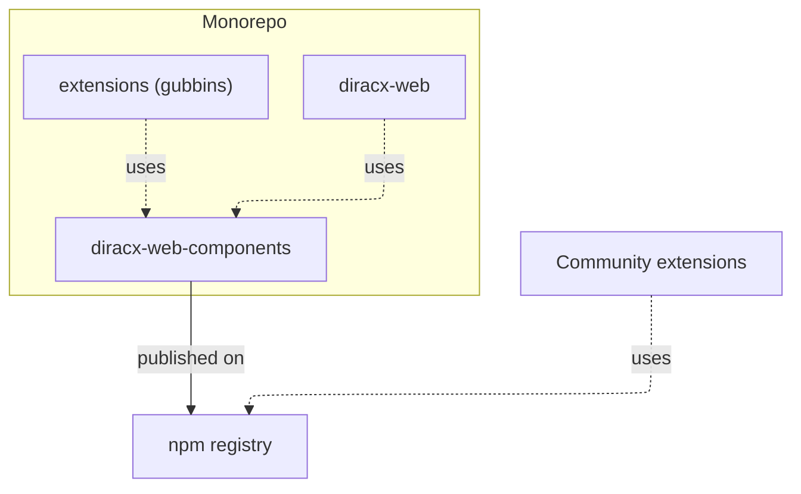

# Web Architecture

DiracX Web is organized as a monorepo using [npm workspaces](https://docs.npmjs.com/cli/v10/using-npm/workspaces). Local packages are resolved from their workspace versions rather than the npm registry.

## Packages

### diracx-web-components

The shared component library, published to npm as `@dirac-grid/diracx-web-components`. It provides:

- **UI components** — Reusable React components built with [Material UI (MUI)](https://mui.com/)
- **Contexts** — React context providers for state management (authentication, application list, theme)
- **Hooks** — Custom React hooks encapsulating reusable logic
- **Types** — TypeScript type definitions

Built with [tsup](https://tsup.egoist.dev/) for fast TypeScript compilation. Outputs to `dist/` with ESM and type declarations. Documented with [Storybook](https://storybook.js.org/), published at [diracgrid.github.io/diracx-web](https://diracgrid.github.io/diracx-web/). Tested with [Jest](https://jestjs.io/) + [React Testing Library](https://testing-library.com/docs/react-testing-library/intro/).

### diracx-web

The vanilla DiracX web interface:

- **Framework**: [Next.js 15](https://nextjs.org/) with App Router
- **Output**: Static export (`output: "export"`)
- **Authentication**: [@axa-fr/react-oidc](https://github.com/AxaFrance/oidc-client)
- **Testing**: [Cypress](https://www.cypress.io/) for end-to-end tests
- **Serving**: Nginx in production (Docker image)

### extensions (gubbins)

Reference example of a custom DiracX web extension. Demonstrates how to extend the application list, add custom components, and deploy as a standalone project. Same Next.js setup as `diracx-web`.

## Key directories

| Path | Description |
|---|---|
| `packages/diracx-web-components/src/components/` | Reusable UI components |
| `packages/diracx-web-components/src/contexts/` | React contexts for state management |
| `packages/diracx-web-components/src/hooks/` | Custom React hooks |
| `packages/diracx-web-components/src/types/` | TypeScript type definitions |
| `packages/diracx-web/src/app/` | Next.js App Router pages and layouts |
| `packages/extensions/src/` | Extension source (gubbins example) |

## Build pipeline

- **Component library**: `tsup` compiles TypeScript to `dist/` with ESM and type declarations.
- **Next.js app**: `next build` exports static HTML/JS/CSS via `output: "export"`.
- **Development**: `npm run dev` starts Next.js in dev mode. The `transpilePackages` config in `next.config.js` allows Next.js to watch and rebuild changes in `diracx-web-components` source directly — no manual rebuild needed.
- **Production / extensions**: Components are consumed from the published `@dirac-grid/diracx-web-components` npm package.

## Routing

DiracX Web uses [Next.js folder-based routing](https://nextjs.org/docs/app/building-your-application/routing):

- `src/app/(dashboard)/` — Main dashboard (parentheses are ignored in the route, so this is the root URL).
- `src/app/auth/` — Authentication pages, served at `/auth`.
- `page.tsx` files define the UI for a route.
- `layout.tsx` files define shared UI for a segment and its children.

## State management

- **Application state**: Managed via React Context (`ApplicationProvider`).
- **Session storage**: Each application instance writes its state to `<appId>_State` for share/import functionality.
- **URL encoding**: Dashboard layout is encoded in the URL for sharing.

## Design system

DiracX Web uses [Material UI (MUI)](https://mui.com/) as its design system. Components should follow MUI patterns and use the MUI theme for consistent styling.
