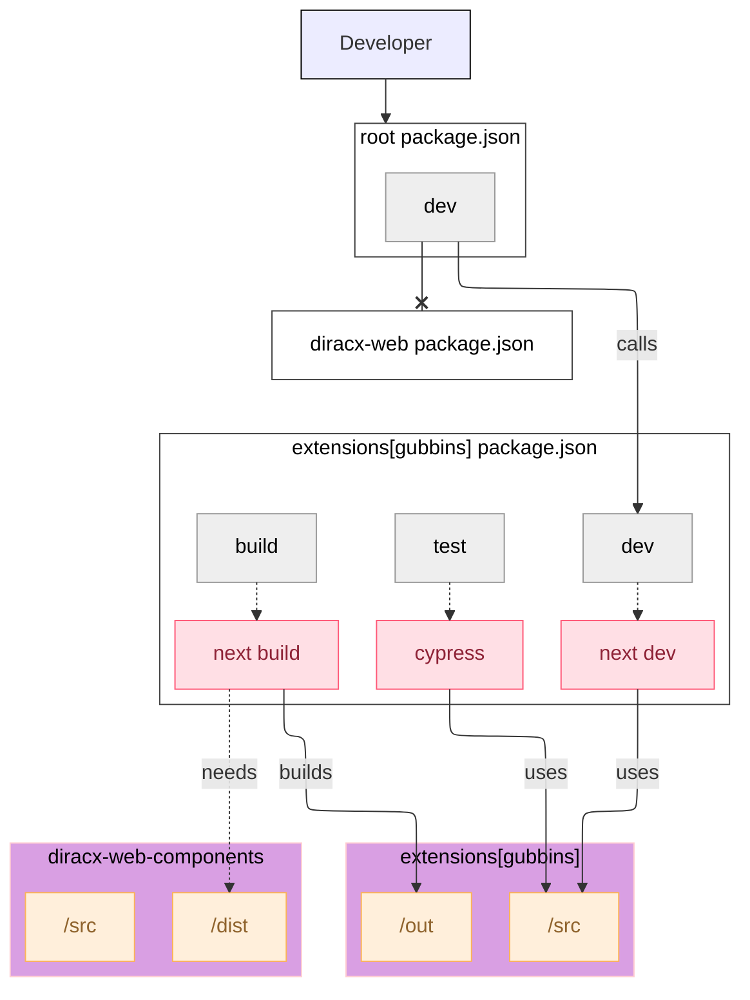

# Managing Extensions

This guide explains how to manage and develop extensions for DiracX Web.

## What are Extensions?

Extensions in DiracX Web allow you to add custom functionality and pages without modifying the core application. They are built as separate packages that integrate with the main application.

## Extension Structure

Extensions follow a specific structure:

```
my-extension/
├── package.json
├── src/
│   ├── components/
│   ├── pages/
│   └── index.ts
└── README.md
```

## The Gubbins Extension

The `gubbins` extension serves as a reference implementation and template for creating new extensions.

### Modifying the `gubbins` extension

This implies setting up the backend as well as the frontend.

#### `gubbins-web` (frontend)



You can simply, and temporarily modify `package.json` by replacing the `dev` command such as:

```bash
jq '.scripts.dev["@dirac-grid/diracx-web-components"] = "npm --prefix packages/extensions run dev"' diracx-web/package.json > diracx-web/package.temp.json
mv diracx-web/package.temp.json diracx-web/package.json
```

And you would provide the `./diracx-web` directory to `diracx-charts/run_demo.sh` as usual:

```bash
# Run the demo
diracx-charts/run_demo.sh ./diracx-web ...[backend params]

# We use the test command from packages/extensions though
export DIRACX_URL=<diracX installation>
npm run --prefix packages/extensions test
```

#### `gubbins` (backend)

Follow the instructions from the [Gubbins extension README](https://github.com/DIRACGrid/diracx/tree/main/extensions#work-on-gubbins).

!!! tip "Automatic Updates"
    Like `diracx-web`, `gubbins-web` does automatically reflect changes made in `diracx-web-components`. This means that while running `gubbins` using `diracx-charts/run_demo.sh`, any modifications to `diracx-web-components` will also be applied to `gubbins`.

### Development Setup

To work with the gubbins extension in development mode:

1. **Navigate to the extensions directory:**
   ```bash
   cd packages/extensions
   ```

2. **Install dependencies:**
   ```bash
   npm install
   ```

3. **Start development with the extension:**
   ```bash
   npm run dev:with-extensions
   ```

## Creating a New Extension

### Using the gubbins extension as a template

1. **Use the gubbins extension as a template:**
   ```bash
   cp -r packages/extensions/gubbins packages/extensions/my-extension
   ```

2. **Update the package.json:**
   ```json
   {
     "name": "@diracx-web/my-extension",
     "version": "0.1.0",
     "description": "My custom DiracX extension"
   }
   ```

3. **Register the extension:**
   Add your extension to the main application's configuration.

!!! info "Extension Guide"
    More details are available in the [**extensions** README](../../packages/extensions/README.md)

## Extension API

Extensions can leverage the following APIs:

### Page Registration

Register new pages in your extension:

```typescript
export const pages = [
  {
    path: '/my-feature',
    component: MyFeatureComponent,
    title: 'My Feature'
  }
];
```

### Component Registration

Register reusable components:

```typescript
export const components = {
  MyCustomComponent,
  AnotherComponent
};
```

## Building Extensions

### Development Build

For development with hot reload:

```bash
npm run build:dev
```

### Production Build

For optimized production builds:

```bash
npm run build
```

## Testing Extensions

Test your extension:

```bash
npm run test:extension my-extension
```

## Deployment

### As Part of Main Application

Extensions built with the main application are included automatically.

### Standalone Deployment

For standalone deployment:

1. Build the extension separately
2. Configure the hosting environment
3. Update the main application to load the remote extension

## Best Practices

1. **Keep extensions lightweight** - Only include necessary dependencies
2. **Follow naming conventions** - Use consistent naming for components and pages
3. **Document thoroughly** - Provide clear README and inline documentation
4. **Test comprehensively** - Include unit and integration tests

## Troubleshooting

### Common Issues

- **Import errors:** Ensure all dependencies are correctly declared
- **Build failures:** Check for TypeScript errors and missing dependencies
- **Runtime errors:** Verify component registration and routing configuration