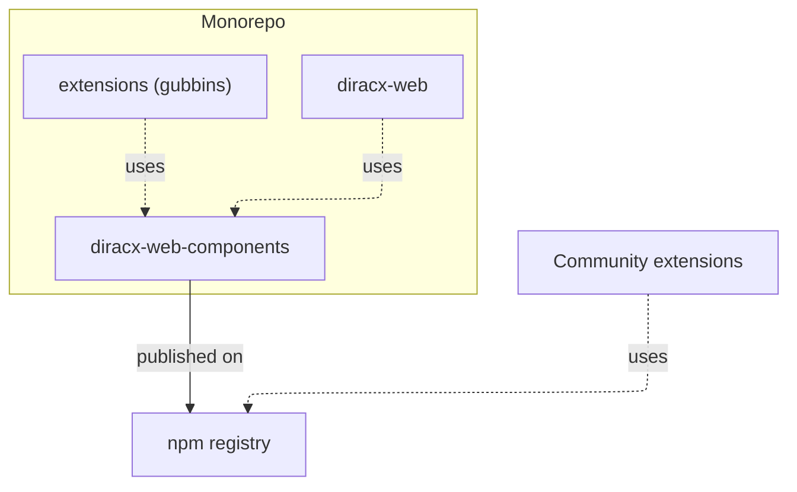

# Web Architecture

## Monorepo Structure

The DiracX-Web repository is organized as a monorepo using [npm workspaces](https://docs.npmjs.com/cli/v10/using-npm/workspaces). Local packages are resolved from their workspace versions rather than the npm registry.

## Packages

### diracx-web-components

- **Purpose**: Reusable React component library.
- **Build tool**: [tsup](https://tsup.egoist.dev/) for TypeScript compilation.
- **Design system**: [Material-UI (MUI)](https://mui.com/).
- **Documentation**: [Storybook](https://storybook.js.org/).
- **Testing**: [Jest](https://jestjs.io/) + [React Testing Library](https://testing-library.com/docs/react-testing-library/intro/).
- **Exports**: Components, contexts, hooks, and types as separate modules.

### diracx-web

- **Purpose**: Vanilla DiracX web interface.
- **Framework**: [Next.js 15](https://nextjs.org/) with App Router.
- **Output**: Static export (`output: "export"`).
- **Authentication**: [@axa-fr/react-oidc](https://github.com/AxaFrance/oidc-client).
- **Testing**: [Cypress](https://www.cypress.io/) for end-to-end tests.
- **Serving**: Nginx in production (Docker image).

### extensions (gubbins)

- **Purpose**: Reference example of a custom DiracX web extension.
- **Framework**: Next.js, same setup as `diracx-web`.
- **Demonstrates**: How to extend the application list, add custom components, and deploy as a standalone project.

## Key Directories

| Path | Description |
|---|---|
| `packages/diracx-web-components/src/components/` | Reusable UI components |
| `packages/diracx-web-components/src/contexts/` | React contexts for state management |
| `packages/diracx-web-components/src/hooks/` | Custom React hooks |
| `packages/diracx-web-components/src/types/` | TypeScript type definitions |
| `packages/diracx-web/src/app/` | Next.js App Router pages and layouts |
| `packages/extensions/src/` | Extension source (gubbins example) |

## Routing

DiracX-Web uses [Next.js folder-based routing](https://nextjs.org/docs/app/building-your-application/routing):

- `src/app/(dashboard)/` — Main dashboard (parentheses are ignored in the route, so this is the root URL).
- `src/app/auth/` — Authentication pages, served at `/auth`.
- `page.tsx` files define the UI for a route.
- `layout.tsx` files define shared UI for a segment and its children.

## State Management

- **Application state**: Managed via React Context (`ApplicationProvider`).
- **Session storage**: Each application instance writes its state to `<appId>_State` for share/import functionality.
- **URL encoding**: Dashboard layout is encoded in the URL for sharing.
