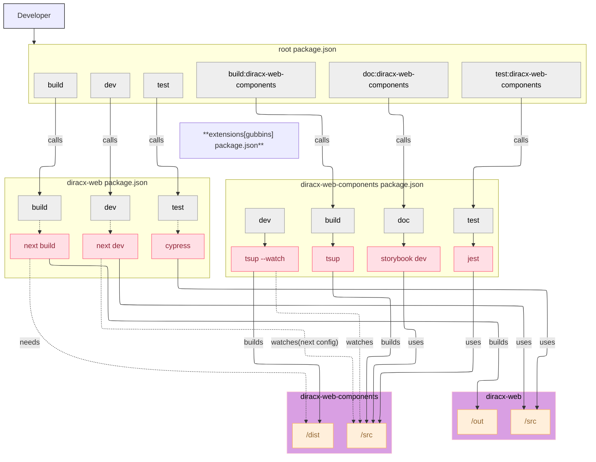

# Setting up your Development Environment



## Running DiracX-Web in development mode

_Requirements: node, npm_

You can start `DiracX-Web` as an `npm` application connecting to a remote backend server - code changes will be reflected in the demo in real time.

```bash
# Clone the diracx-web repository
git clone git@github.com:DIRACGrid/diracx-web.git

cd diracx-web

# Install it
npm ci

# Set the DiracX backend URL you are targeting
export DIRACX_URL=<backend url>

# Run it
npm run dev
```

## Running DiracX-Web in development mode along DiracX

_Requirements: docker, internet, node_

If you need to modify `DiracX` in parallel, or if you do not have access to the remote backend logs,
then you can also start the full demo setup in development mode:

```bash
# Clone the diracx-web repository
git clone git@github.com:DIRACGrid/diracx-web.git

# [Optional] Clone the diracx repository
git clone git@github.com:DIRACGrid/diracx.git

# Clone the diracx-chart repository
git clone git@github.com:DIRACGrid/diracx-charts.git

# Run the demo
diracx-charts/run_demo.sh ./diracx-web [./diracx]
```

:bulb: Any change made in `diracx-web-components` are automatically reflected into the development environment. We rely on the [NextJS transpile option](https://nextjs.org/docs/app/api-reference/config/next-config-js/transpilePackages). Further details are available in the `diracx-web` NextJS configuration.

## Testing

[Jest](https://jestjs.io/) unit tests can be started with:

```bash
npm run test:diracx-web-components
```

End-to-end tests are launched through [Cypress](https://www.cypress.io/) such as:

```bash
# diracx-charts/run_demo.sh is running
export DIRACX_URL=<diracX installation>
npm run --prefix packages/diracx-web test
```

## Documenting

[Storybook](https://storybook.js.org/docs) can be started with:

```bash
npm run doc:diracx-web-components
```
