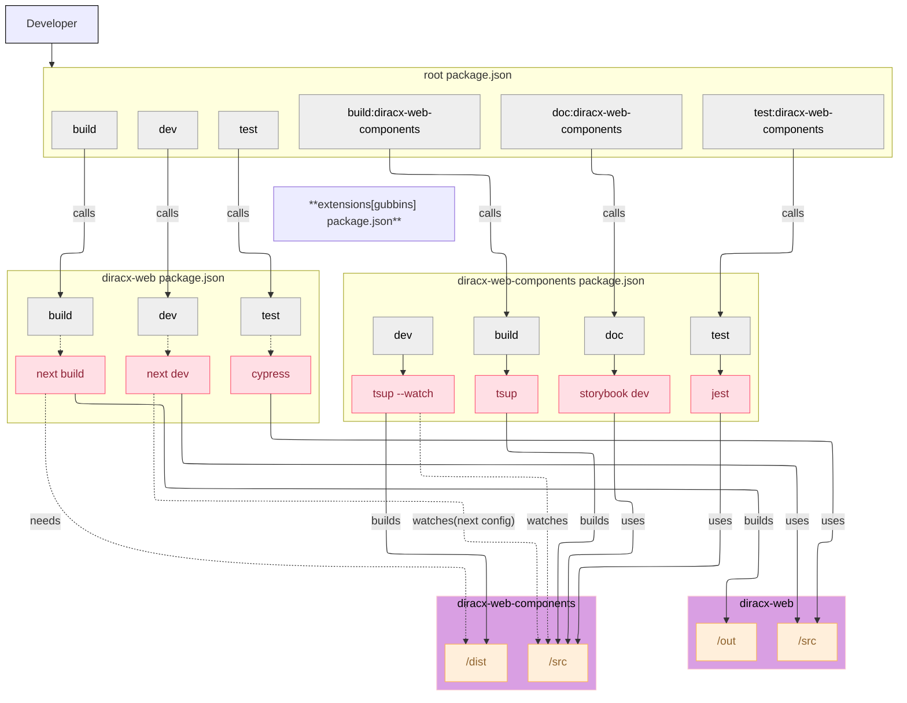

# Getting Started with DiracX-Web Development

Welcome to DiracX-Web development! This tutorial will guide you through setting up your development environment and getting your first local instance running. By the end of this guide, you'll have a working development setup and understand the project architecture.



## What You'll Learn

In this tutorial, you'll learn how to:

- Set up your development environment
- Understand the DiracX-Web project structure  
- Run the application locally
- Make your first changes with hot reload
- Run tests and documentation tools

## Prerequisites

Before we begin, make sure you have the following installed on your system:

- **Node.js** (version 18 or higher) - [Download here](https://nodejs.org/)
- **npm** (comes with Node.js)
- **Git** - [Download here](https://git-scm.com/)

## Step 1: Clone and Set Up the Project

Let's start by getting the DiracX-Web code on your machine and installing dependencies.

```bash title="Clone and install dependencies"
# 1. Clone the repository
git clone git@github.com:DIRACGrid/diracx-web.git

# 2. Navigate to the project directory
cd diracx-web

# 3. Install all dependencies (this may take a few minutes)
npm ci
```

🎉 Great! You now have all the project dependencies installed.

## Step 2: Understanding the Project Structure

Before running the application, let's understand what you just downloaded. DiracX-Web is a monorepo with three main parts:

```
diracx-web/
├── packages/
│   ├── diracx-web-components/    # 📦 Reusable React components library
│   ├── diracx-web/               # 🌐 Main Next.js web application  
│   └── extensions/               # 🔌 Example extensions
├── docs/                         # 📚 Documentation (you're reading this!)
└── package.json                  # 🛠️ Root package configuration
```

The architecture diagram above shows how these pieces work together during development.

## Step 3: Run Your First Development Server

Now let's get the application running locally. You have two options:

### Option A: Connect to a Remote Backend (Recommended for Beginners)

This is the easiest way to get started - you'll run the frontend locally but connect to an existing DiracX backend:

```bash title="Run with remote backend"
# Set the backend URL (replace with actual backend)
export NEXT_PUBLIC_DIRACX_URL=<backend url>

# Start the development server
npm run dev
```

Once you run this command, open your browser to `http://localhost:3000` and you should see the DiracX-Web interface! 🚀

### Option B: Full Local Development (Advanced)

If you want to run both the frontend and backend locally, or need to modify DiracX backend code:

!!! info "Additional Requirements for Option B"
    - Docker
    - Internet connection

```bash title="Running full development environment"
# 1. Clone additional repositories
git clone git@github.com:DIRACGrid/diracx.git        # Backend code (optional)
git clone git@github.com:DIRACGrid/diracx-charts.git # Deployment scripts

# 2. Run the full demo environment
diracx-charts/run_demo.sh ./diracx-web [./diracx]
```

!!! tip "Hot Reload Magic"
    Any changes you make to the `diracx-web-components` library are automatically reflected in your running application. This is powered by NextJS's transpile feature - no manual rebuilds needed!

## Step 4: Explore the Development Tools

Now that you have the application running, let's explore the development tools available:

### Component Documentation with Storybook

DiracX-Web uses [Storybook](https://storybook.js.org/) to document and showcase the component library:

```bash title="View component documentation"
npm run doc:diracx-web-components
```

This opens Storybook at `http://localhost:6006` where you can:
- Browse all available components
- See live examples and documentation
- Test component variations interactively

### Running Tests

DiracX-Web has comprehensive testing coverage:

```bash title="Run component unit tests"
# Test the component library
npm run test:diracx-web-components
```

For end-to-end testing (requires a running backend):

```bash title="Run E2E tests"
# Make sure your development server or demo is running first
export DIRACX_URL=<your-diracx-installation-url>
npm run --prefix packages/diracx-web test
```

### Code Quality Tools

Keep your code clean with the built-in linting and formatting:

```bash title="Check code quality"
# Lint all code
npm run lint

# TypeScript type checking
npm run ts-lint
```

## Step 5: Make Your First Change

Let's make a simple change to verify everything is working:

1. **Find a component** - Open `packages/diracx-web-components/src/components/` 
2. **Make a small change** - Edit any component file (try changing some text)
3. **See it live** - Your browser should automatically refresh and show the change!

## What's Next?

Congratulations! 🎉 You now have a working DiracX-Web development environment. Here's what you can explore next:

- **📖 Read the [Contributing Guidelines](contribute.md)** - Learn the development workflow and coding standards
- **🔧 Explore the [Extension Management Guide](manage_extension.md)** - Learn how to create and manage extensions
- **📚 Browse the [Project Architecture](../explanations/web-arch.md)** - Understand the technical decisions behind DiracX-Web
- **🏗️ Check the component library** - Run Storybook and explore available components

## Getting Help

If you run into issues:

1. **Check existing [GitHub Issues](https://github.com/DIRACGrid/diracx-web/issues)**
2. **Start a [Discussion](https://github.com/DIRACGrid/diracx-web/discussions)** for questions
3. **Review the [Contributing Guidelines](contribute.md)** for development practices

Happy coding! 🚀