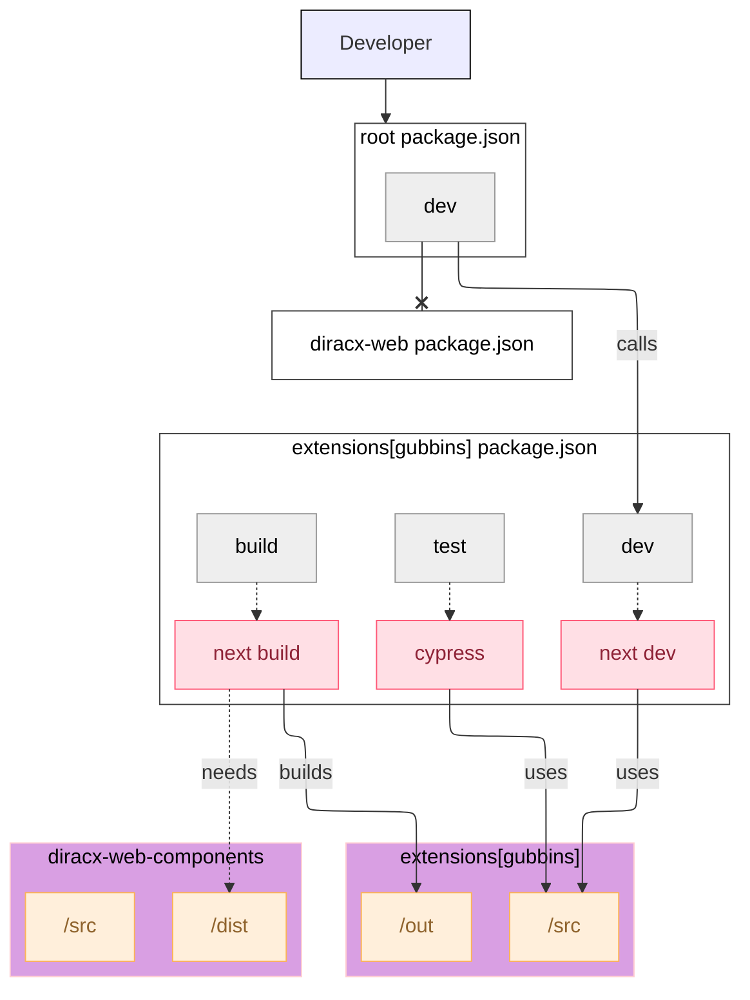

# Dealing with an extension

## Modifying the `gubbins` extension

This implies setting up the backend as well as the frontend.

### `gubbins-web` (frontend)



You can simply, and temporarily modify `package.json` by replacing the `dev` command such as:

```bash
jq '.scripts.dev["@dirac-grid/diracx-web-components"] = "npm --prefix packages/extensions run dev"' diracx-web/package.json > diracx-web/package.temp.json
mv diracx-web/package.temp.json diracx-web/package.json
```

And you would provide the `./diracx-web` directory to `diracx-charts/run_demo.sh` as usual:

```bash
# Run the demo
diracx-charts/run_demo.sh ./diracx-web ...[backend params]

# We use the test command from packages/extensions though
export DIRACX_URL=<diracX installation>
npm run --prefix packages/extensions test
```

### `gubbins` (backend)

Follow the instructions from the [Gubbins extension README](https://github.com/DIRACGrid/diracx/tree/main/extensions#work-on-gubbins).

:bulb: Like `diracx-web`, `gubbins-web` does automatically reflect changes made in `diracx-web-components`. This means that while running `gubbins` using `diracx-charts/run_demo.sh`, any modifications to `diracx-web-components` will also be applied to `gubbins`.

## Creating a new extension

More details available in the [**extensions** README](../../packages/extensions/README.md)