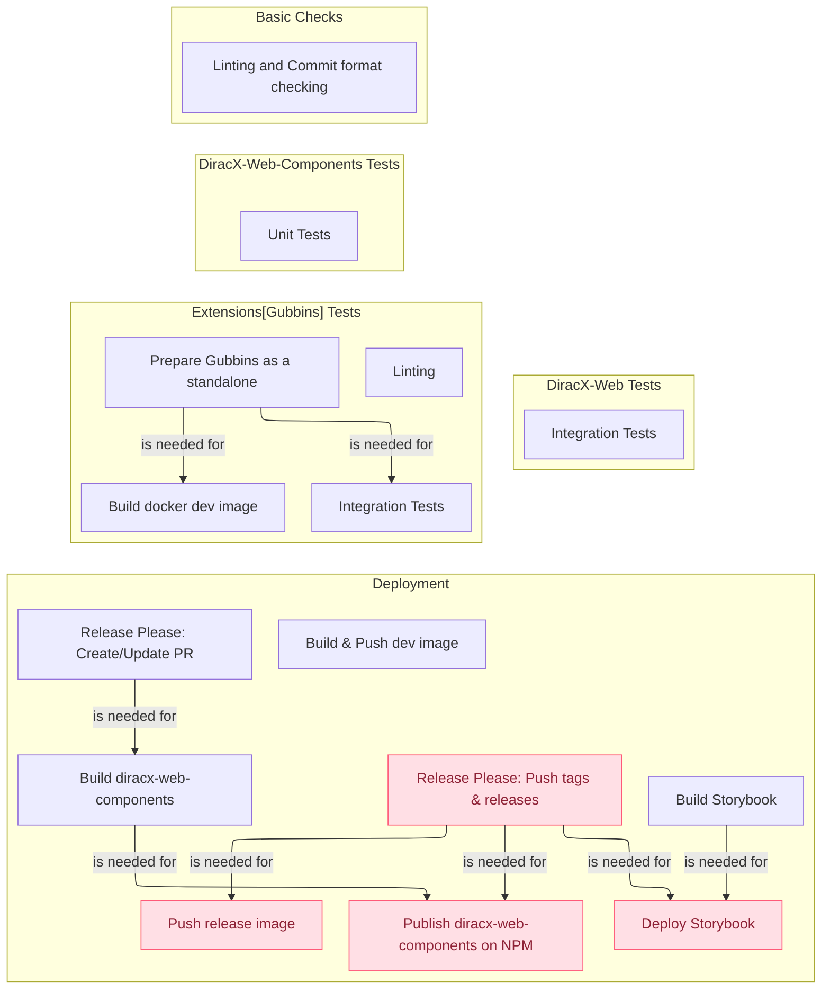

# Administrator Guide

Welcome to the DiracX-Web Administrator Guide! This comprehensive resource is designed to assist you in effectively managing, deploying, and maintaining the DiracX-Web repository. Whether you're overseeing releases, handling dependencies, or configuring the system, this guide provides the necessary insights and instructions.

The following graph gives you an overview of the [Github Action Workflows](../../.github/workflows/):

## Content

- [Deploy DiracX-Web](./deploy_instance.md)
- [Manage dependencies](./manage_dependencies.md)
- [Manage releases](./manage_release.md)